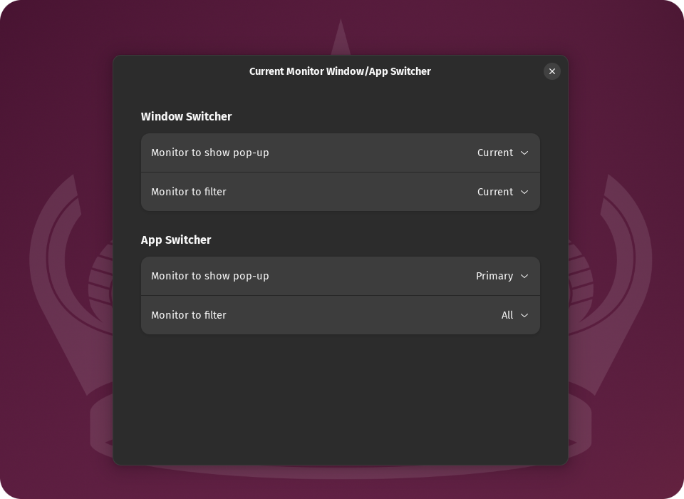

# Current Monitor Window/App Switcher

GNOME shell extension that includes only applications from the current monitor in the Window Switcher and App Switcher.

<p align="center">
    
</p>

## Installation

### GNOME Shell Extensions website

https://extensions.gnome.org/extension/7460/current-monitor-windowapp-switcher/

### Manually

1. Clone the repository:
```sh
cd ~/.local/share/gnome-shell/extensions
git clone https://github.com/thmatosbr/current-monitor-window-app-switcher.git current-monitor-window-app-switcher@thmatosbr
```
2. Restart GNOME Shell:
  - Press <kbd>Alt</kbd>+<kbd>F2</kbd> and run the built-in `restart` command
3. Enable the extension:
```sh
gnome-extensions enable current-monitor-window-app-switcher@thmatosbr
```

## Versions support

This extension supports GNOME Shell version `45` and later. For earlier versions, you can use the [Current screen only in windows switcher](https://extensions.gnome.org/extension/1437/current-screen-only-for-alternate-tab/) or the [Window/App switcher on active monitor](https://extensions.gnome.org/extension/5568/monitor-window-switcher-2/) extensions.
